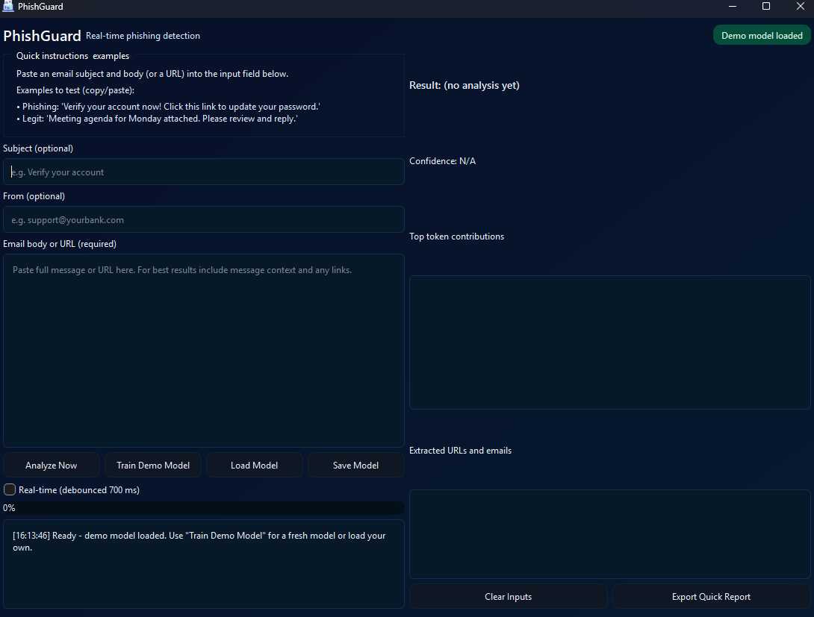

# PhishGuard - README

> **Important:** PhishGuard is a real-time phishing detection tool implemented in Python using PyQt6. It allows you to analyze email bodies, subjects, and URLs for potential phishing attempts. Read this document carefully to understand installation, running, packaging, troubleshooting, and ethical use guidance.

---

## Logo


## ScreenShot



## Table of contents

1. [Quick start](#1-quick-start)
2. [What is PhishGuard (short)](#2-what-is-phishguard-short)
3. [Running from source (recommended for developers)](#3-running-from-source-recommended-for-developers)
4. [Building a single-file `.exe` using PyInstaller (packaging)](#4-building-a-single-file-exe-using-pyinstaller-packaging)
5. [Files included in the build (what to bundle)](#5-files-included-in-the-build-what-to-bundle)
6. [Runtime requirements & optional features](#6-runtime-requirements--optional-features)
7. [Packaging caveats, exe size & tips](#7-packaging-caveats-exe-size--tips)
8. [How real-time analysis & debounce works](#8-how-real-time-analysis--debounce-works)
9. [Troubleshooting common errors](#9-troubleshooting-common-errors)
10. [Testing & diagnostics](#10-testing--diagnostics)
11. [Security, ethics & license (MUST READ)](#11-security-ethics--license-must-read)
12. [Contributing guidelines](#12-contributing-guidelines)
13. [Release notes & changelog (v1.0)](#13-release-notes--changelog-v10)
14. [Credits & acknowledgements](#14-credits--acknowledgements)
15. [FAQ](#15-faq)
16. [Appendix: Useful commands and examples](#16-appendix-useful-commands-and-examples)

---

## 1) Quick start

To run PhishGuard locally for development or testing:

1. Clone or copy the `PhishGuard` folder into a working directory.
2. Create a clean Python virtual environment:

```bash
python -m venv .venv
# Windows
.venv\Scripts\activate
# macOS / Linux
source .venv/bin/activate

Run the app from the project root:

bash

python PhishGuard.py
This opens the main window with demo phishing model loaded.

2) What is PhishGuard (short)
PhishGuard is an educational and practical tool to detect phishing emails or malicious URLs. It:

Processes email text or URLs in real-time.

Extracts URLs and email addresses for inspection.

Uses a TF-IDF + Logistic Regression pipeline for scoring.

Shows token-level contributions for explainability.

Important: Designed for learning and research. Do not use to attack, spam, or harass.

3) Running from source (recommended for developers)
Use Python 3.9+ (3.10/3.11 supported).

Use a virtual environment to isolate dependencies.

Core dependencies:

text

PyQt6
numpy
pandas
scikit-learn
joblib
Launch with:

bash
python PhishGuard.py
Notes:

If any optional module is missing, the main UI still works.

Input boxes allow pasting email subjects, senders, or full body text. For best results, include context and URLs.

4) Building a single-file .exe using PyInstaller
Warning: The PyQt6 runtime and model pipeline may produce a large .exe.

Example PyInstaller command bundling all core files and icons:

bash
Копирај кȏд
pyinstaller --noconfirm --clean --onefile \
  --name PhishGuard \
  --add-data "PhishGuard.py;." \
  --add-data "AI3.ico;." \
  --icon AI3.ico \
  PhishGuard.py
Platform notes:

Run PyInstaller on the target platform (Windows recommended for .exe).

Use --onedir to reduce startup time and avoid large single-file builds.

Include .ico and .png for UI icons.

5) Files included in the build (what to bundle)
PhishGuard.py (main entry)

AI3.ico (application icon)

icon.png (optional UI graphic)

Any .joblib models (pre-trained or user-saved)

6) Runtime requirements & optional features
Required:

Python 3.9+

PyQt6

scikit-learn, numpy, pandas, joblib

Optional:

Additional Python packages for extended functionality (custom preprocessing, logging, or analytics).

Missing optional packages will gracefully disable extra features.

7) Packaging caveats, exe size & tips
PyQt6 includes Qt runtime; expect hundreds of MB for single-file .exe.

Reduce size by:

Using --onedir format.

Excluding unused optional modules via --exclude-module.

Compressing icons or optional assets.

Include .ico and .png files explicitly in --add-data.

8) How real-time analysis & debounce works
Real-time toggle performs analysis automatically after 700 ms of inactivity.

Debouncing ensures UI remains responsive.

Analysis runs in a separate thread to avoid freezing the interface.

9) Troubleshooting common errors
Model not loaded

Train demo model or load saved .joblib file first.

File -> Load Model to select an existing pipeline.

PyQt6 widget issues

Ensure PyQt6 is installed correctly for your Python version.

If buttons, text edits, or progress bars fail to render, check your environment and restart.

Prediction thread errors

Errors in prediction show in the log panel.

Check Python traceback for missing modules or corrupted .joblib files.

10) Testing & diagnostics
Built-in demo model allows immediate testing.

Paste phishing and legitimate examples to evaluate pipeline.

Export quick reports via Export Quick Report button.

11) Security, ethics & license (MUST READ)
PhishGuard is for educational and research purposes only.

Do not send phishing emails or abuse analysis results.

Only analyze emails or URLs you have permission to inspect.

Responsible disclosure: Do not share sensitive credentials.

License: MIT or as provided in repository root.

12) Contributing guidelines
Fork repository

Use a feature branch

Add unit tests for new features

Submit pull request with clear description

Follow ethical and legal guidelines in all contributions.

13) Release notes & changelog (v1.0)
v1.0: Initial release with:

TF-IDF + Logistic Regression demo model

Real-time phishing detection

URL and email extraction

Token contribution visualization

Save/load model support

Export quick report feature

PyQt6 polished QSS UI with ICO/PNG assets

14) Credits & acknowledgements
Built with Python and PyQt6. Thanks to scikit-learn, pandas, numpy, and joblib for ML and data handling.

15) FAQ
Q: Can I analyze URLs only?
A: Yes, paste them in the body input box. PhishGuard will extract and score URLs.

Q: Can I use my own trained model?
A: Yes, use the Load Model button to import .joblib pipelines.

Q: How accurate is the demo model?
A: Designed for education; it uses a synthetic dataset. Accuracy is illustrative, not production-grade.

16) Appendix: Useful commands and examples
Run in development mode:

bash

python PhishGuard.py
Build a .exe with PyInstaller:

bash

pyinstaller --noconfirm --clean --onefile \
--name PhishGuard \
--add-data "PhishGuard.py;." \
--add-data "AI3.ico;." \
--add-data "icon.png;." \
--icon AI3.ico \
PhishGuard.py
Train a fresh demo model (inside UI):

Click Train Demo Model button

Wait for progress bar to complete

Analyze email content or URLs

Final words
Thank you for using PhishGuard. This README ensures smooth setup, safe use, and correct packaging. Always follow ethical guidance when analyzing real-world emails or URLs.

End of README